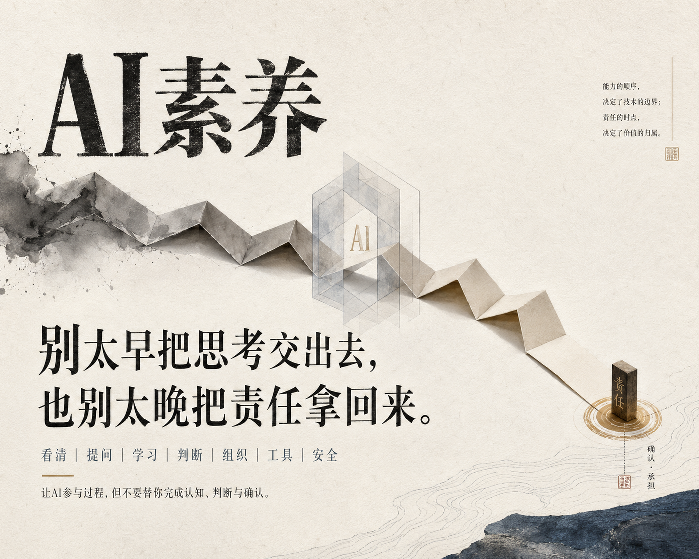

# AI素养：大学生的第一本人工智能启蒙书

**从提问、学习、判断到智能协作**

---

## 写作动机

2026年的今天，几乎所有的本科生都已经在学习和使用AI，大部分学生承认会用生成式AI辅助被评估的作业。大学不能再假设"学生可能会用AI"，必须默认"学生已经在用AI"。

市面上关于AI的书并不少。面向开发者的技术手册讲API调用和模型微调，面向管理者的趋势报告讲产业格局和商业模式。留给大学生的，大多是"如何使用ChatGPT"之类的工具操作指南，却很少触及一个根本问题：

> **在AI无处不在的世界里，你作为一个正在成长的年轻人，到底应该建立什么样的底层能力？**

这不是一本教你"使用AI工具"的书。工具会迭代，界面会更新。这是一本教你在AI时代重新学习如何**学习、思考、判断、表达、组织信息和承担责任**的书。

贯穿全书的核心逻辑是：**AI时代真正稀缺的不是工具，而是使用工具的人所具备的底层能力。**

## 全书框架

本书将AI时代的底层能力提炼为**七种素养**，对应七个部分、十五个章节：

| 部分 | 核心素养 | 章节 | 核心问题 |
|:---:|:---:|:---:|:---|
| 第一部分 | 认知素养 | 第1-2章 | AI是什么？它不是什么？ |
| 第二部分 | 表达素养 | 第3-5章 | 如何清晰定义任务并与AI协作？ |
| 第三部分 | 学习素养 | 第6-7章 | 如何用AI深化学习而不是替代思考？ |
| 第四部分 | 判断素养 | 第8-9章 | 如何评估AI输出的质量？ |
| 第五部分 | 信息素养 | 第10-11章 | 如何组织信息让AI真正帮上忙？ |
| 第六部分 | 工具素养 | 第12-13章 | 如何理解和选择AI工具？ |
| 第七部分 | 责任素养 | 第14-15章 | 如何安全、诚信、负责地使用AI？ |

## 各部分概览

### 第一部分 -- 重新认识AI

先看清AI，再相信AI。它会像专家一样流畅，也会像骗子一样笃定。理解大语言模型的本质是概率推断而非知识检索，认清"流畅不等于正确"的核心陷阱。

- **第1章** 每个专业都需要新的基础素养
- **第2章** AI不是搜索引擎，也不是万能老师

### 第二部分 -- 学会提问

会提问，才会协作。模糊想法要被整理成清晰任务。好的问题定义比任何Prompt技巧都更重要。掌握BACS框架，学会准备上下文和迭代式协作。

- **第3章** 问题定义：比Prompt更重要的能力
- **第4章** Context：会准备工作环境
- **第5章** 迭代式协作：不是许愿，而是校准

### 第三部分 -- 学会学习

把AI当陪练，不当代练。它应逼你思考，而不是替你思考。用AI深化理解，而不是制造理解的幻觉。

- **第6章** AI学习法：从答案依赖到深度理解
- **第7章** AI作为思维伙伴：批判、反例、推演与复盘

### 第四部分 -- 学会判断

生成越快，判断越要慢。看起来专业，不等于值得采纳。当生产成本趋近于零，价值从"能做出来"转向"能判断好坏"。

- **第8章** 审美、品味与判断力：AI时代的价值转移
- **第9章** AI输出七问法：系统化的质量评估框架

### 第五部分 -- 学会组织信息

先整理信息，再期待答案。清晰结构是高质量协作的前提。让AI读得懂、找得到、用得对。

- **第10章** 文件、文本与数据：AI时代的信息载体
- **第11章** 结构化表达：让信息可理解、可检查、可复用

### 第六部分 -- 学会使用工具

学会选工具，而不是追新工具。知道何时用、为何用，比会不会用更重要。从Chatbot到Agent的演化逻辑，Tool Use、MCP与自动化。

- **第12章** 从Chatbot到Agent：AI产品形态如何演化
- **第13章** AI如何长出手脚：工具、协议、技能与自动化

### 第七部分 -- 学会安全行动

先设边界，再让AI行动。权限、隐私、版权与人工确认，是底线。不理解的命令不执行，这是不可妥协的安全原则。

- **第14章** 不害怕技术环境：命令行、安装、版本与报错
- **第15章** 责任、验证与人的主体性

## 面向读者

本书面向**所有专业的大学生**。你不需要有计算机科学背景，不需要会编程，不需要理解神经网络的数学原理。你只需要有好奇心、有耐心，以及一种对自己的学习和成长负责的意愿。

 

**AI可以帮你走得更快，但你自己决定走向哪里。**

