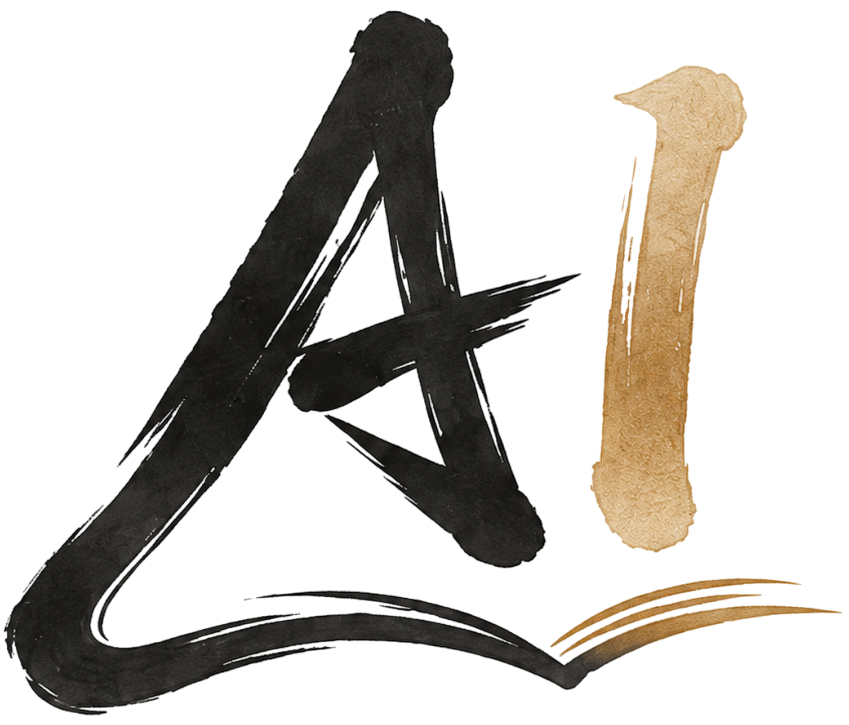
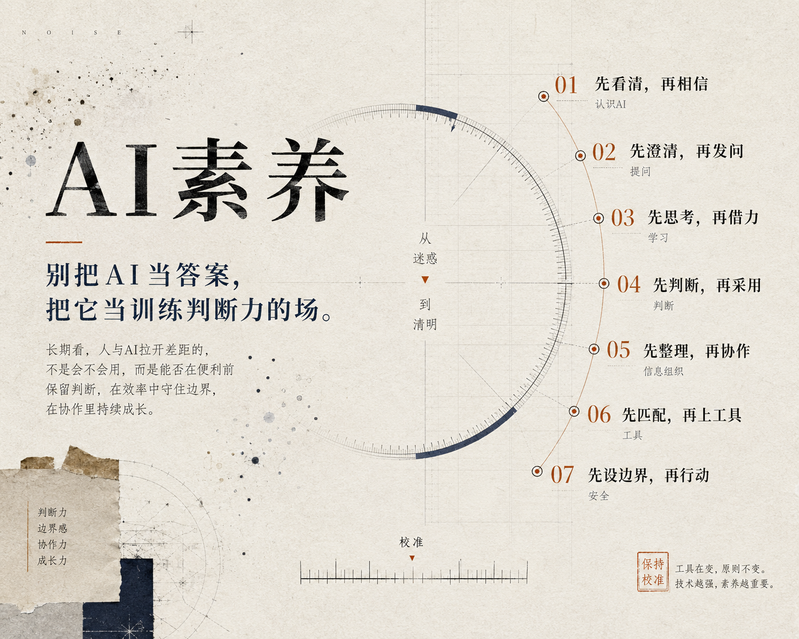
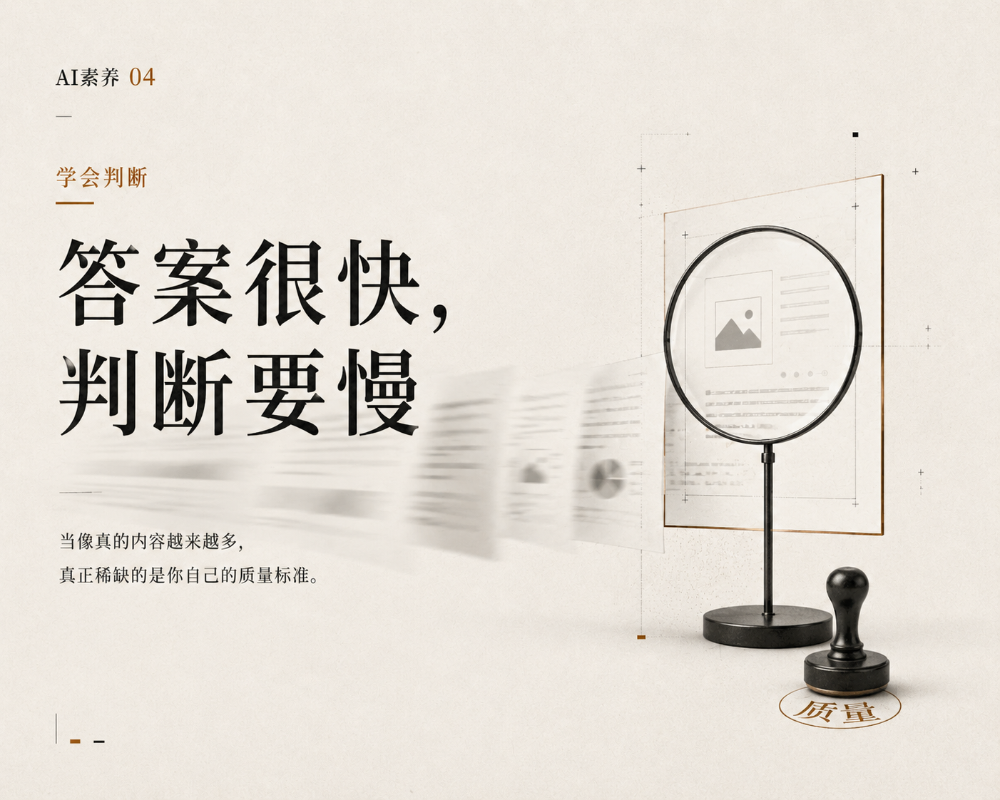
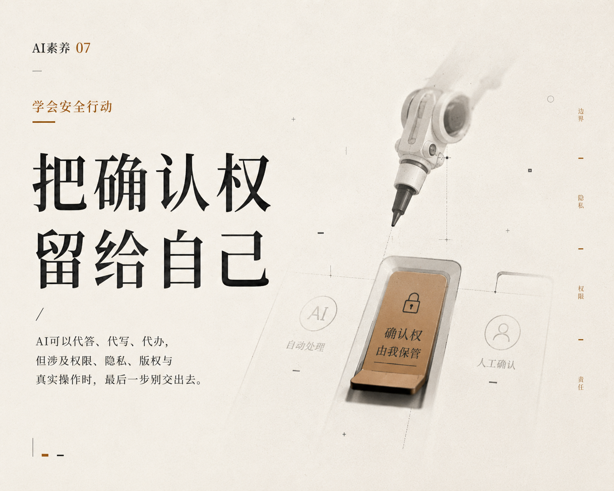

<div align="center">



# AI素养：大学生的第一本人工智能启蒙书

**从提问、学习、判断到智能协作**

[](https://vitepress.dev/)
[](https://github.com/hyyhf/ai-competency-book/actions)
[](LICENSE-CONTENT)
[](LICENSE)

[**在线阅读**](https://hyyhf.github.io/ai-competency-book/) · [**开始阅读**](https://hyyhf.github.io/ai-competency-book/preface) · [**提交反馈**](https://github.com/hyyhf/ai-competency-book/issues)

</div>

---

<div align="center">

</div>

<br />

## 这本书讲什么

2026年的今天，几乎所有的本科生都已经在使用AI。大学不能再假设“学生可能会用AI”，必须默认**学生已经在用AI**。

市面上关于AI的书并不少 -- 面向开发者的讲API调用，面向管理者的讲产业格局。留给大学生的，大多是工具操作指南，却很少触及一个根本问题：

> **在AI无处不在的世界里，你作为一个正在成长的年轻人，到底应该建立什么样的底层能力？**

这不是一本教你“使用AI工具”的书。工具会迭代，界面会更新。这是一本教你在AI时代重新学习如何**学习、思考、判断、表达、组织信息和承担责任**的书。

贯穿全书的核心逻辑：**AI时代真正稀缺的不是工具，而是使用工具的人所具备的底层能力。**

## 全书框架

本书将AI时代的底层能力提炼为 **七种素养**，对应七个部分、十五个章节：

```
                        AI素养能力图谱
    ┌──────────────────────────────────────────────┐
    │                                              │
    │   认知        表达        学习        判断    │
    │   ┌───┐      ┌───┐      ┌───┐      ┌───┐    │
    │   │1-2│  ->  │3-5│  ->  │6-7│  ->  │8-9│    │
    │   └───┘      └───┘      └───┘      └───┘    │
    │   AI是什么    如何提问    如何学习    如何判断  │
    │                                              │
    │   信息        工具        责任                │
    │   ┌────┐     ┌────┐     ┌────┐               │
    │   │10-11│ -> │12-13│ -> │14-15│              │
    │   └────┘     └────┘     └────┘               │
    │   组织信息    使用工具    安全行动             │
    │                                              │
    └──────────────────────────────────────────────┘
```

<table>
<thead>
<tr>
<th align="center">部分</th>
<th>核心素养</th>
<th>章节</th>
<th>你将学会</th>
</tr>
</thead>
<tbody>
<tr>
<td align="center"><strong>一</strong></td>
<td>重新认识AI</td>
<td>第 1-2 章</td>
<td>理解大语言模型的本质是概率推断而非知识检索，认清"流畅不等于正确"的核心陷阱</td>
</tr>
<tr>
<td align="center"><strong>二</strong></td>
<td>学会提问</td>
<td>第 3-5 章</td>
<td>用BACS框架定义清晰任务，准备上下文，掌握迭代式协作</td>
</tr>
<tr>
<td align="center"><strong>三</strong></td>
<td>学会学习</td>
<td>第 6-7 章</td>
<td>把AI当陪练而非代练，用费曼检验法深化理解而非制造理解的幻觉</td>
</tr>
<tr>
<td align="center"><strong>四</strong></td>
<td>学会判断</td>
<td>第 8-9 章</td>
<td>当生产成本趋近于零，价值从"能做出来"转向"能判断好坏"</td>
</tr>
<tr>
<td align="center"><strong>五</strong></td>
<td>学会组织信息</td>
<td>第 10-11 章</td>
<td>先整理信息再期待答案，让AI读得懂、找得到、用得对</td>
</tr>
<tr>
<td align="center"><strong>六</strong></td>
<td>学会使用工具</td>
<td>第 12-13 章</td>
<td>从Chatbot到Agent的演化逻辑，Tool Use、MCP与自动化</td>
</tr>
<tr>
<td align="center"><strong>七</strong></td>
<td>学会安全行动</td>
<td>第 14-15 章</td>
<td>权限、隐私、版权与人工确认 -- 不理解的命令不执行</td>
</tr>
</tbody>
</table>

## 各部分导览

<table>
<tr>
<td width="50%" align="center">
<br />
<strong>第一部分 -- 重新认识AI</strong><br />
<sub>先看清AI，再相信AI。它会像专家一样流畅，也会像骗子一样笃定。</sub>
</td>
<td width="50%" align="center">
<br />
<strong>第二部分 -- 学会提问</strong><br />
<sub>会提问，才会协作。好的问题定义比任何Prompt技巧都更重要。</sub>
</td>
</tr>
<tr>
<td align="center">
<br />
<strong>第三部分 -- 学会学习</strong><br />
<sub>AI应逼你思考，而不是替你思考。</sub>
</td>
<td align="center">
<br />
<strong>第四部分 -- 学会判断</strong><br />
<sub>生成越快，判断越要慢。看起来专业，不等于值得采纳。</sub>
</td>
</tr>
<tr>
<td align="center">
<br />
<strong>第五部分 -- 学会组织信息</strong><br />
<sub>清晰结构是高质量协作的前提。</sub>
</td>
<td align="center">
<br />
<strong>第六部分 -- 学会使用工具</strong><br />
<sub>知道何时用、为何用，比会不会用更重要。</sub>
</td>
</tr>
<tr>
<td colspan="2" align="center">
<br />
<strong>第七部分 -- 学会安全行动</strong><br />
<sub>先设边界，再让AI行动。这是不可妥协的安全原则。</sub>
</td>
</tr>
</table>

## 面向读者

本书面向**所有专业的大学生**。你不需要有计算机科学背景，不需要会编程，不需要理解神经网络的数学原理。你只需要：

- 对AI时代保持**好奇心**
- 对自己的学习和成长有**责任感**
- 愿意花时间去**思考**，而不只是寻找答案


## 本地开发

```bash
# 克隆仓库
git clone https://github.com/hyyhf/ai-competency-book.git
cd ai-competency-book

# 安装依赖
npm install

# 启动本地开发服务器
npm run docs:dev

# 构建生产版本
npm run docs:build

# 预览构建结果
npm run docs:preview
```


## 参与贡献

欢迎通过以下方式参与：

1. **内容反馈** -- 发现错误或有改进建议？[提交 Issue](https://github.com/hyyhf/ai-competency-book/issues)
2. **内容贡献** -- Fork 本仓库，修改后提交 Pull Request
3. **传播分享** -- 望可以分享给更多需要的同学

## 许可协议

本项目采用**双协议**授权：

| 范围 | 协议 | 说明 |
|:---|:---|:---|
| **书籍内容**（文字、插图、Markdown文档） | [CC BY-NC-ND 4.0](LICENSE-CONTENT) | 允许分享，禁止商用，禁止修改 |
| **网站代码**（Vue组件、CSS、配置脚本） | [MIT](LICENSE) | 自由使用，需保留版权声明 |

> 欢迎阅读和分享本书内容，但请勿用于商业目的或修改后再分发。

---

<div align="center">

**『AI可以帮你走得更快，但你需要自己决定走向哪里。』**

<sub>Made with care for every student navigating the AI era.</sub>

</div>
